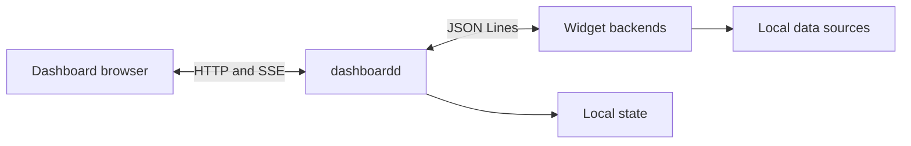

# dashboardd

dashboardd is a local-first dashboard for monitoring and controlling one computer. It combines machine telemetry, AI usage, projects, and tasks in a keyboard-driven interface.

## Principles

- Local data stays local.
- Normal dashboard views answer the primary question at a glance.
- Focus adds research and explicit controls.
- Widget backends are separate processes with a language-neutral protocol.
- Installed widget packages are trusted local software.
- Dashboard state uses clean breaking schemas during the prototype phase.

## Documentation

- [Quick start](quick-start.md) runs the development build.
- [User guide](user-guide/index.md) explains dashboards, navigation, and configuration.
- [Widget authoring](widget-authoring/index.md) defines the public extension contracts.
- [Development](development.md) lists repository checks and common commands.
