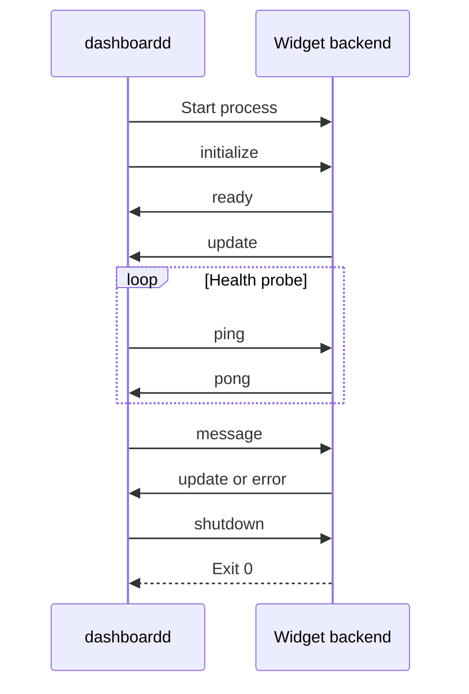

# Backend protocol

Backend protocol version 1 is a language-neutral JSON Lines protocol over process stdin and stdout. The machine-readable schema is [`schemas/widget-backend-v1.schema.json`](https://github.com/alexjercan/dashboardd/blob/master/schemas/widget-backend-v1.schema.json).

Each line is one UTF-8 JSON envelope:

```json
{ "version": 1, "kind": "ping", "data": { "nonce": 42 } }
```

- `version` is the backend protocol version.
- `kind` selects a direction-specific message.
- `data` contains the message fields.
- Unknown JSON object fields are ignored.
- Unknown kinds, missing fields, malformed JSON, and unsupported versions are errors.

Protocol messages and only protocol messages use stdout. Diagnostics use stderr. A backend must flush stdout after every line.

## Process lifecycle

One backend process serves one placed widget instance.



dashboardd writes `initialize` immediately after process start. The backend announces `ready` as soon as its protocol loop is available. It must announce the manifest widget ID and must not send updates before `ready`.

dashboardd currently probes every 10 seconds and marks an instance stale after 30 seconds without valid protocol activity. On shutdown, a backend must stop accepting work, complete necessary cleanup, close normally, and exit zero within three seconds.

## dashboardd to backend

### `initialize`

```json
{
  "version": 1,
  "kind": "initialize",
  "data": {
    "instance_id": "today-1",
    "widget_id": "today",
    "variant_id": "summary",
    "options": {}
  }
}
```

The identifiers and validated effective options apply for the process lifetime.

### `message`

```json
{
  "version": 1,
  "kind": "message",
  "data": { "instance_id": "today-1", "payload": { "command": "refresh" } }
}
```

The payload is owned and versioned by the widget. `WidgetContext.send()` confirms server delivery, not backend completion. Writable widgets should include command IDs and report pending, success, or failure through later updates.

### `ping`

```json
{ "version": 1, "kind": "ping", "data": { "nonce": 42 } }
```

Return the same nonce in `pong`.

### `error`

```json
{
  "version": 1,
  "kind": "error",
  "data": {
    "error": { "code": "invalid_message", "message": "Message was rejected" }
  }
}
```

This reports a server-side protocol problem to the backend.

### `shutdown`

```json
{ "version": 1, "kind": "shutdown", "data": {} }
```

## Backend to dashboardd

### `ready`

```json
{ "version": 1, "kind": "ready", "data": { "widget_id": "today" } }
```

A different widget ID terminates the backend connection.

### `update`

```json
{
  "version": 1,
  "kind": "update",
  "data": { "instance_id": "today-1", "payload": { "tasks_remaining": 2 } }
}
```

Updates sent before `ready`, or with another instance ID, are rejected. The payload belongs to the widget and is forwarded to its frontend.

### `pong`

```json
{ "version": 1, "kind": "pong", "data": { "nonce": 42 } }
```

An unexpected nonce is a protocol error.

### `error`

```json
{
  "version": 1,
  "kind": "error",
  "data": {
    "instance_id": "today-1",
    "error": { "code": "invalid_command", "message": "Unknown command" }
  }
}
```

Use `null` for `instance_id` when no instance can be identified. Codes are stable widget-owned machine identifiers. Messages are safe human-readable diagnostics.

## Minimal Python framing

```python
import json
import sys


def send(kind: str, data: dict) -> None:
    print(json.dumps({"version": 1, "kind": kind, "data": data}), flush=True)


send("ready", {"widget_id": "example"})
for line in sys.stdin:
    message = json.loads(line)
    if message["version"] != 1:
        raise RuntimeError("unsupported protocol version")
    if message["kind"] == "ping":
        send("pong", {"nonce": message["data"]["nonce"]})
    elif message["kind"] == "shutdown":
        break
```

Production backends must also validate every message shape, identifier, and widget-owned payload.
