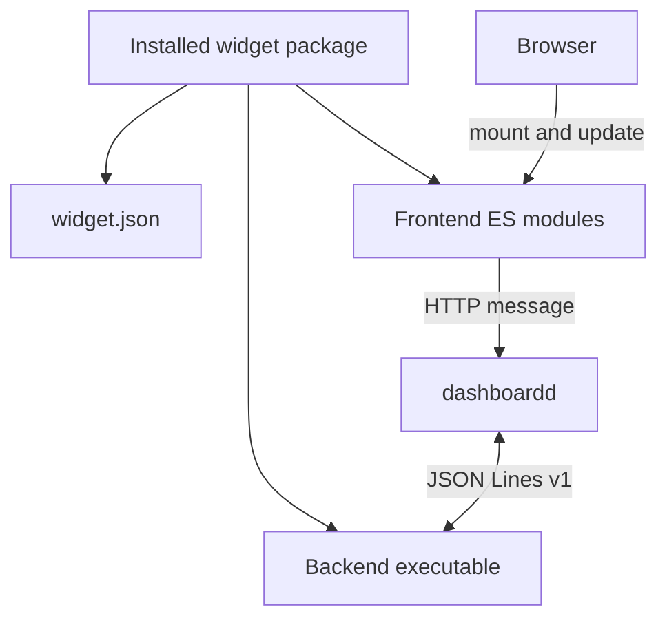

# Widget authoring

A widget package contains one backend executable and one or more frontend variants. dashboardd treats the installed package as trusted local software.

The three extension contracts are versioned independently:

- [Packaging and checks](packaging.md) - source manifests and standalone bundles.
- [Runtime bundle](runtime-bundle.md) - discovery and metadata.
- [Backend protocol](backend-protocol.md) - process communication.
- [Frontend contract](frontend.md) - browser lifecycle and capabilities.

`dashboardd-widget` packages already-built artifacts without assuming a language or build system. The repository `xtask` uses the same packer after it builds bundled widgets.

## Trust boundary

A backend runs with the dashboardd user's permissions. Install widgets only from trusted sources. Runtime manifests contain artifact paths and metadata only. They must never contain build commands.

Frontend code runs in the dashboard page inside a Shadow DOM mount. Shadow DOM isolates styles, not authority. A frontend can use the capabilities supplied through `WidgetContext`.
